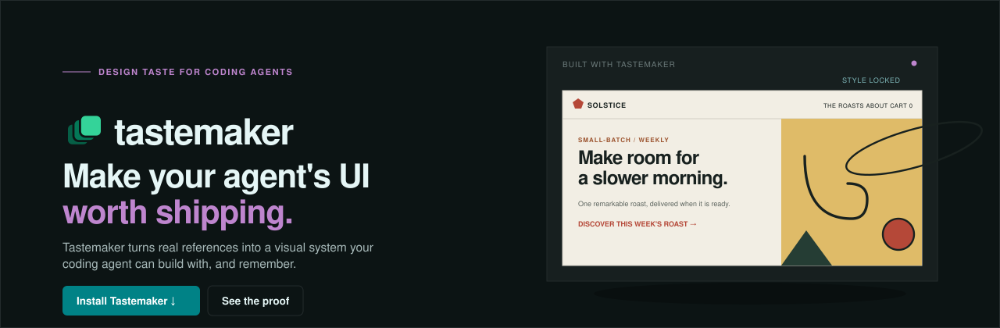
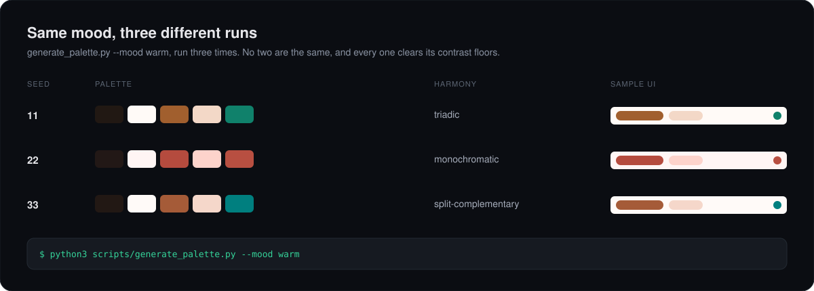

<div align="center">
  

  <p>
    <a href="LICENSE"></a>
    <a href="https://github.com/codeswithroh/tastemaker/stargazers"></a>
    <a href="CONTRIBUTING.md"></a>
    
    <a href="https://tastemaker-skill.online"></a>
  </p>

  <p><b>A skill that gives AI real design taste, so the UI it builds does not look AI-generated.</b></p>

  <p>
    <a href="#see-the-difference-not-just-the-claim">Before / after</a> &nbsp;·&nbsp;
    <a href="#quick-start">Quick start</a> &nbsp;·&nbsp;
    <a href="#why-ai-ui-all-looks-the-same">Why</a> &nbsp;·&nbsp;
    <a href="#can-i-not-just-tell-the-ai-to-write-the-decisions-down">Why not just prompt it?</a> &nbsp;·&nbsp;
    <a href="#what-is-verified-and-what-is-judgment">What is verified</a> &nbsp;·&nbsp;
    <a href="#what-you-get">Features</a> &nbsp;·&nbsp;
    <a href="#the-palette-generator">Palette generator</a> &nbsp;·&nbsp;
    <a href="#research">Research</a> &nbsp;·&nbsp;
    <a href="#contributing">Contributing</a>
  </p>

  <p><a href="https://tastemaker-skill.online"><b>See it live and try the demo &rarr;</b></a></p>
</div>

<br>

## What this is

Tastemaker is a skill for coding agents. Native support: Claude Code (recommended), Windsurf, and Gemini CLI. You install it once and forget it. Whenever you ask your agent to build or style a UI, tastemaker steps in and gives it a real design system to work from, instead of the generic defaults every model reaches for.

It is plain Markdown and small Python scripts. Everything runs on your machine. There is no hosted backend, no account, and no API key. Design memory is local too: project choices live in `.tastemaker/style-lock.md` and `.tastemaker/decisions.log`; durable personal preferences live in `~/.tastemaker/profile.md`.

## See the difference, not just the claim

One prompt, `build a landing page for a coffee subscription`, built twice: once with no skill, once with tastemaker installed. Same request, unchanged, both times.

<div align="center">
  <a href="https://tastemaker-skill.online/compare"><b>Open the live before/after &rarr;</b></a>
</div>

Left is the indigo-gradient, letter-in-a-box-logo, emoji-icon default most agents reach for. Right is the same prompt with tastemaker: a palette generated fresh for the project's mood, real fetched icons, a constructed mark, and motion, in one pass. Both are real, live pages, not mockups or screenshots.

## Why AI UI all looks the same

Ask any model to build a UI and you tend to get the same thing: an indigo to purple gradient, a soft shadow card, a generic hero. This is not a prompting problem. It happens because the model has to invent taste from a text description, with nothing real to ground it and no memory of what you actually like.

Tastemaker fixes this with four ideas, not a bigger catalog of canned options to pick from:

1. **Generate within a check that actually runs.** There is no fixed list of color combinations shipped with this skill, and the palette is not five approved colors the model may combine however it likes either. A new one is generated per project (a fresh hue and harmony each time) against a contract: `check_contrast.py --matrix` computes every pairing and says which may carry text, which may carry a border, and which may carry neither. So the constraint produces variety instead of sameness, and a rule that runs is different in kind from a rule you wrote down, because it returns the same answer no matter how confident anyone felt.
2. **Ground in real pixels, not words.** Give it a screenshot or a reference and it reads the real colors and contrast from the actual image, using a script. It does not write a vague summary of the vibe and rebuild from that. Text summaries lose most of what made the reference feel specific.
3. **Remember, do not re-derive.** Once a project locks a style, every later screen reuses it. Nothing drifts. Across projects, a small profile file learns what you keep and what you reject, so your next project starts warm.
4. **Scope to the real work.** It reads your spec first and figures out which screens actually need design, instead of dumping a design system that has nothing to do with what you are shipping.

## "Can I not just tell the AI to write the decisions down?"

Yes, partly, and it is worth being straight about where the line is.

If you say *"lock these decisions as a design bible and use it as our anchor,"* you get the decisions written down in the current context. For keeping three screens consistent inside one chat, that genuinely works, and you do not need this skill for it.

Here is what that does not give you:

- **It does not survive the session.** The bible lives in context. Close the chat and it is gone, or you re-paste it and hope. Tastemaker writes `.tastemaker/style-lock.md` and `.tastemaker/decisions.log` to your repo, then promotes durable resolved preferences into `~/.tastemaker/profile.md`. Project decisions survive the conversation, and real keep/reject patterns can carry into the next project.
- **It has no check that runs.** A written-down preference is still a judgment you can talk yourself out of. `check_contrast.py --matrix` is a computation. It does not care how good the palette looked to you, and it returns the same verdict every time. That is the difference between an intention and a constraint.
- **It cannot read pixels.** "Match this reference" through a conversation becomes a text description of an image, then a rebuild from the description. `extract_palette.py` reads the actual pixel values.
- **It leaves the combinations to improvisation.** A written bible lists your colors. It does not enumerate which of those colors may legally touch which, so the model still guesses when it invents a badge fill or a disabled state. The matrix answers that up front.

Short version: a conversation gives you the decision. This gives you the decision plus something that enforces it after you have stopped paying attention.

## What is verified, and what is judgment

Worth separating these two clearly, because it is easy to let one stand in for the other, and this project has been guilty of that.

**Verified (a computation, not taste).** Contrast and readability. `check_contrast.py` runs real WCAG math over the palette and reports pass or fail. This is accessibility, not aesthetics. A palette that clears every ratio can still be ugly. The reason it belongs here anyway is that it catches a class of failure your eyes genuinely cannot: contrast is a calculation, and looking at a color confidently is not running it. Early hand-picked palette drafts for two moods failed that check on the first pass, and only the script caught it. That failure is the reason color is generated against the contract now instead of hand-tuned and hoped.

**Judgment (heuristics and memory, not proof).** Everything that is actually taste: the reference extraction, the mood-to-palette matching, the accumulated profile, and the anti-slop checklist. These are informed defaults and accumulated preference. They are not verified, and this README should not imply they are. They get better with your references and your rejections, not with more math.

Do not read the contrast script as evidence that the design is good. Read it as evidence that the design is legible, which is a smaller and more checkable claim.

## Quick start

**Claude Code plugin (recommended):**

```bash
/plugin marketplace add codeswithroh/tastemaker
/plugin install tastemaker@codeswithroh
```

**Manual install**, for Claude Code without the plugin system, or for Windsurf: clone the repo, then copy or symlink the `skills/tastemaker` folder specifically (not the whole repo) into your tool's skills directory:

```bash
git clone https://github.com/codeswithroh/tastemaker /tmp/tastemaker
cp -r /tmp/tastemaker/skills/tastemaker ~/.claude/skills/tastemaker
```

> Using Windsurf? Same copy, into `.windsurf/skills/` instead. Windsurf reads the native `SKILL.md` format directly, `references/` and all.

**Gemini CLI: one command, no manual copying.** Gemini CLI reads the native `SKILL.md` format directly too, `references/`, `scripts/`, and the vendored `ideagram/` sub-skill included, verified with a real local install, not assumed from the file-format similarity to Claude Code:

```bash
gemini skills install https://github.com/codeswithroh/tastemaker --path skills/tastemaker
```

This installs tastemaker (and `ideagram`, its vendored illustration sub-skill) globally for Gemini CLI, byte-for-byte identical to the source. First run in a project may ask you to trust the folder before workspace-scoped skills activate; global installs (the default here) don't need that.

**Cursor: not a straight copy, and currently degraded even then.** Cursor doesn't read `SKILL.md` natively; it needs conversion to its own `.mdc` rule format (via a tool like [openskills](https://github.com/numman-ali/openskills)), and that conversion strips out supporting directories entirely. Since nearly all of tastemaker's actual mechanism lives in `references/` (the palette contract, macrostructure catalog, anti-slop gates) and `scripts/` (the palette generator, contrast checker), a Cursor install currently loses the parts that make tastemaker work, not just a cosmetic difference. Verified against Cursor's actual conversion behavior rather than assumed from the plugin-format similarity to Claude Code. Until Cursor ships native `SKILL.md` support with subdirectories intact, don't expect full functionality there.

Restart your agent, then just ask:

```
build a landing page for a coffee subscription
```

Tastemaker triggers on its own. It generates a palette, picks a matching type pairing, sources real assets, wires up motion, and builds. You do not invoke anything.

For the deterministic color extraction script you need Python 3 and Pillow (`pip install Pillow`). If Pillow is missing, it falls back to a vision based read instead of failing.

## What you get

| | |
|---|---|
| **Grounded in real pixels** | Reference images become real color tokens through `scripts/extract_palette.py`, not a text guess. |
| **Reference-led without user references** | Cold starts create `.tastemaker/reference-board.md`: competitors, adjacent products, cultural sources, interface systems, anti-references, dials, and a direction contract. |
| **A new palette every time, never reused** | `generate_palette.py` builds a fresh palette per project: a base hue in the mood's range, a color-harmony rule for the accent, and per-role lightness solved so the contrast pairings clear their floors. Two similar prompts get two different, legible palettes, never the same one twice. |
| **A contrast contract, not a one time check** | `check_contrast.py --matrix` computes every pairing in the palette and reports which may carry text, which may carry a border, and which may carry neither. The generator satisfies this by construction, so a fresh palette is still a legible one. This buys readability, not taste. |
| **Mechanical anti-slop scan** | `anti_slop_scan.py` flags high-confidence tells such as generic purple gradients, gradient text, `h-screen`, dead links, missing alt text, placeholder copy, emoji icons, eyebrow spam, and `transition-all`. |
| **Real illustrations** | Each concept is matched to real illustrator grade art and recolored to your palette, not drawn from scratch by the model. |
| **A real logo, not a letter in a box** | A constructed geometric mark plus a full favicon set, readable down to 16px. |
| **Motion by default** | GSAP and ScrollTrigger reveals plus a sequenced hero, wired during the build and not left as a follow up. |
| **Motion with restraint** | `audit_motion.py` catches common craft failures such as `transition: all`, `ease-in`, `scale(0)`, long UI timing, layout-property animation, ungated hover motion, and missing reduced-motion handling. |
| **Better app screens** | Screen-type guidance covers dashboards, app shells, data tables, forms, loading, empty, error, focus, pressed, and success states, so the skill does not only shine on landing pages. |
| **Prototype before guessing** | High-risk UI can branch into real variants behind a picker, then promote the version that feels right. |
| **Attribution free assets** | Photos (Openverse), icons (Iconify), and illustrations all need no keys and no visible credit line. |
| **Taste that compounds** | `.tastemaker/style-lock.md` keeps project rules, `.tastemaker/decisions.log` records keep/reject evidence, and `~/.tastemaker/profile.md` carries durable preferences into the next project. |

## The palette generator

When you have no reference, tastemaker does not hand you a color picker, and it does not hand you a fixed color scheme to choose from either. **It generates one, on the spot, for your project.** A menu of five fixed options is still a menu: install the skill twice for two different products and you would get the same five outcomes. That is a smaller monoculture, not a solved one.

Instead, `scripts/generate_palette.py` classifies your app idea into a mood (premium, warm, technical, playful, or elegant, by keyword), then builds a genuinely new palette for it every run:

- A **base hue** chosen at random within the mood's hue range.
- A **color-harmony rule** for the accent: analogous, complementary, triadic, split-complementary, or monochromatic.
- Every role's **lightness solved against the contrast contract**, in OKLCH, so text, button labels, and accents clear their WCAG floors by construction, not by hand-tuning after the fact. This is the same target-ratio idea behind Adobe Leonardo's color engine.

The proof is that the same mood produces different, and equally legible, output every time:

<div align="center">
  
</div>

Run it yourself:

```bash
python3 scripts/generate_palette.py --mood technical
```

It prints the roles as hex, a live preview link, and the full contrast matrix, which pairing may carry text, which may only carry a border, and which is decorative, ready to paste straight into `.tastemaker/style-lock.md`. Pass `--seed <n>` to reproduce an exact result; omit it and every run is new. Fonts stay curated per mood (a real Google Font pairing, chosen for the mood's character, so there is no licensing question); only the color is generated.

Icons follow the same idea at a smaller scale: each mood maps to two candidate Iconify sets, not one, and `fetch_icons.py` picks between them per run the same way the palette generator picks a fresh hue — so two "technical" projects aren't guaranteed the same Lucide icons any more than two "premium" projects are guaranteed the same palette.

**What's still fixed, honestly:** font pairing (5 curated pairs, one per mood) and illustration matching (each concept maps to the closest fit in a finite local unDraw library) are not generated the way color and icons now are. Two projects in the same mood can still land on the same font pairing, and two projects needing the same abstract concept (a "team collaboration" illustration, say) can match the same source SVG — though the recolor itself differs, since it's tinted to that project's independently generated accent, not a shared default. This is a real, acknowledged limit, not a solved problem dressed up as one; widening either axis further is open work, not a claim already made good on.

## How it works

```
1. Read the idea      references, or the app concept itself
2. Build references   quality bar, anti-references, design read, and dials
3. Lock the style     palette and type, contrast checked, written to a lock file
4. Source assets      photos, illustrations, icons, logo, favicons, in one pass
5. Pick libraries     use proven primitives for hard UI behavior instead of hand-rolling
6. Build screens      visual first, app states covered, motion and slop scans checked
7. Prototype variants when direction is uncertain
8. Remember taste     what you keep rolls into a profile for the next project
```

The full workflow lives in [`SKILL.md`](SKILL.md). The reference files in [`references/`](references/) hold the deep material and are read only when a step needs them.

## Read the story

I wrote up why I built this and how it works:

**[Every AI built site looks the same, so I built a skill that locks taste before any code is written](https://dev.to/codeswithroh/every-ai-built-site-looks-the-same-so-i-built-a-skill-that-locks-taste-before-any-code-is-written-4f6d)**

## Research

Background writing that shaped tastemaker's rules: a real question, a real method (something measured, read, or tested), and a link to the PR that shipped the result. Not a restatement of a PR description as if it were independent research.

- **[Real section spacing, measured, not guessed](research/section-spacing-measurement.md)**
- **[Studying Hallmark: what a 15.7k-star anti-slop skill does that we didn't](research/hallmark-architecture-study.md)**
- **[The contrast check certifies the palette as authored, not as used](research/contrast-as-authored-vs-as-used.md)**
- **[Non-Latin script typography isn't a font swap, it changes the model](research/non-latin-typography.md)**

## Project layout

```
tastemaker/
├── .claude-plugin/              plugin + marketplace manifests (the plugin install path)
├── skills/tastemaker/           the actual skill, this is what gets installed
│   ├── SKILL.md                 the workflow, read this first
│   ├── references/              palettes, patterns, motion, asset sourcing, checklists
│   ├── scripts/                 palette generation, contrast check, extraction, asset fetch, recolor
│   ├── assets/                  GSAP motion starter and a dependency free fallback
│   └── ideagram/                vendored illustration-sourcing sub-skill
├── research/                    background investigation behind the skill's rules
└── site/                        the marketing site and live demo
```

## Contributing

Contributions are very welcome. Bug reports, new mood ranges or harmony rules for the generator, better docs, and new layout patterns all help.

Please read [CONTRIBUTING.md](CONTRIBUTING.md) before you start, and see the [Code of Conduct](CODE_OF_CONDUCT.md). Good first issues are labeled [`good first issue`](https://github.com/codeswithroh/tastemaker/labels/good%20first%20issue).

If tastemaker saved you from one more indigo gradient, a star helps other builders find it.

## Support the project

tastemaker is free, MIT licensed, and built in the open. If it saves you time or makes something you ship look better, sponsoring helps keep the palette generator, the asset pipeline, and the pattern library maintained.

[Sponsor on GitHub](https://github.com/sponsors/codeswithroh)

**Want something tangible back, not just a thank-you?** [Unlock sponsor-exclusive Aesthetic Modes](https://buy.polar.sh/polar_cl_tY4OjST0hD2YW36YeNrDJgHs6Ybz9vmsQeHNX0YSbl4) for $8/month: thin style-override layers on top of the same free engine (brutalist, glassmorphic, minimalist, soft/premium-calm, more added over time), each swapping in a specific, fully worked-out design language rather than just a different color. The core skill stays free forever; this is where the paid add-ons live. Modes may graduate into the free repo once they've funded a sponsor threshold, so early subscribers fund the next one, not just this one.

### Community sponsors

No community sponsors yet. The moment GitHub Sponsors gets its first backer, their avatar goes here.

### Star history

<a href="https://star-history.com/#codeswithroh/tastemaker&Date">
  
</a>

---

**tastemaker has no official token, coin, or crypto project.** Any token using this project's name, logo, or branding is unaffiliated and not endorsed by the maintainer.

## License

[MIT](LICENSE). Use it freely, including in commercial work.
