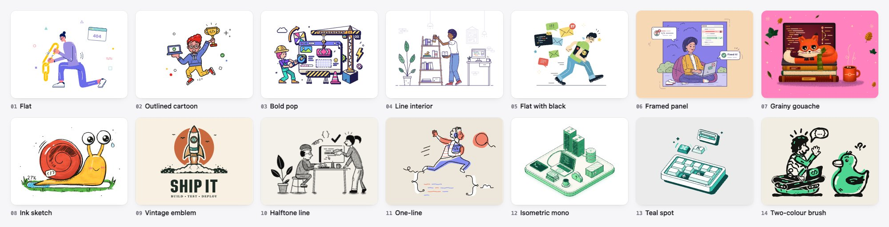

# Illustration Skills

Fourteen skills for drawing original spot illustrations as hand-written SVG, one skill per style. Each skill draws new cards that look like they came from the same hand as its three example cards: design and coding scenes at 480 × 360, for empty states, onboarding, 404 pages, blog headers, feature spots and marketing cards.



The skills were extracted from a set of 42 original cards, three per style. Blind judges scored those cards against commercial illustration packs, with 8 out of 10 as the bar. Every rule in a skill comes either from measuring those cards' SVG code or from a fault the judges or a designer caught. After each skill was written, a fresh card on a new subject was drawn using only that skill's folder. Every test exposed something missing, and the skill was fixed.

| Skill | Use it for |
| --- | --- |
| [Flat](illustration-flat/SKILL.md) | Slim, long-limbed people with one hero prop. No outlines on big shapes, thin white fold strokes, lavender, indigo, yellow, coral and mint, and floating confetti. |
| [Outlined Cartoon](illustration-outlined-cartoon/SKILL.md) | Big-headed characters in a warm ink outline weighted 2.5 / 2 / 1.5 px, with huge white eyes, blob hair and "+" sparkle crosses. |
| [Bold Pop](illustration-bold-pop/SKILL.md) | A dense cluster of chunky props on solid navy extrusions, with saturated fills textured by navy hatching and dots. |
| [Line Interior](illustration-line-interior/SKILL.md) | Wide, airy rooms in one thin indigo line around white fills, with flat colour on under 7% of the card. |
| [Flat with Black](illustration-flat-with-black/SKILL.md) | Tall people in flat denim, leaf green, sun yellow and tomato, held together by big solid black shapes and one thin ground line. |
| [Framed Panel](illustration-framed-panel/SKILL.md) | A violet panel framed in navy on a pastel card, with bubbles, UI cards and bushes breaking out across the frame. |
| [Grainy Gouache](illustration-grainy-gouache/SKILL.md) | Cosy animals on hot pink, with soft gradient shading, a fine multiply grain gathered at the edges and a chalky pooled shadow. |
| [Ink Sketch](illustration-ink-sketch/SKILL.md) | Googly-eyed critters in tapered brush-pen outlines, with loose marker fills, hatched shadows and stray ink hairs. |
| [Vintage Emblem](illustration-vintage-emblem/SKILL.md) | Screen-print badges: one hero object on a terracotta sun disc, a splash band and a heavy condensed wordmark. |
| [Halftone Line](illustration-halftone-line/SKILL.md) | Black open-contour line on warm paper, where every grey is a field of halftone dots. No colour. |
| [One-line](illustration-one-line/SKILL.md) | Action figures drawn as one continuous black line, over coral and periwinkle patches knocked out of register. |
| [Isometric Mono](illustration-isometric-mono/SKILL.md) | True-isometric developer workspaces on one bevelled slab, with every face shaded from a single green ramp. |
| [Teal Spot](illustration-teal-spot/SKILL.md) | One hero object in an oblique 3/4 view, white with teal sides and a hard deep-teal drop shadow. No people. |
| [Two-colour Brush](illustration-two-colour-brush/SKILL.md) | Chunky characters in a fat, wobbly black marker line, with a mint second ink slipped off the line and squiggle camo. |

## What each skill contains

```txt
illustration-<style>/
  SKILL.md              the look in one sentence, palette, line and fill numbers, characters,
                        decor, composition, techniques, failure modes, workflow, verify checklist
  style.json            palette and rules as data; lint.mjs checks cards against it
  examples/             the style's three cards, the fidelity anchor for every new card
  references/craft.md   rules shared by every style: the SVG file contract, originality,
                        hands and handedness, pose, contact, composition, scoring
  scripts/
    render.mjs          headless renders: a whole card at 2x, a zoomed region re-rendered
                        from vector, or a sheet of cards side by side
    lint.mjs            the file contract (viewBox, id prefixes, no <style> or <image>)
                        plus off-palette colours
    <style kit>.mjs     a dependency-free generator for the style's repeated parts
  demo/                 index.html with the three cards and the palette, PROMPT.md, preview.jpg
  agents/openai.yaml
```

`render.mjs` needs `playwright-core` in the current folder, next to the script or installed globally (`npm i -g playwright-core`), plus a Chromium. Everything else runs on plain Node.

## Use a skill

Copy the skill folder into your agent's skills directory, or load its `SKILL.md` directly as context. Use the narrowest style that fits, and keep one style per page: the styles don't mix.

```text
Use $illustration-ink-sketch to draw a "Cache Miss" card for our 404 page.
```

```text
Use $illustration-isometric-mono to draw a "Data Pipeline" scene for the docs header.
```

```text
Use $illustration-vintage-emblem to make a "Release Day" badge for the launch post.
```

```text
Use $illustration-flat to draw three onboarding cards: connect a repo, invite the team, ship.
```
